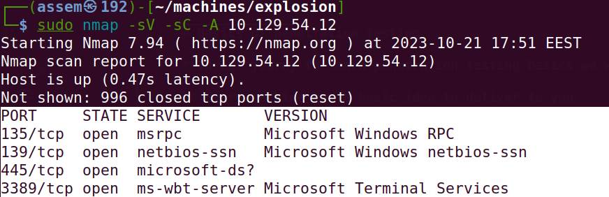

# Basics of penetration testing 

**In our journy to learn penetration testing basics we will take a machines in HTB to can explain the basics of penetration** 

## Every machine has a basic idea to deliver to you .

- in this machine you should get familiar with `RDP` .
	
	***what is RDP mean ?***

	- RDP refer to `Remote Disktop Protocol` .
	
	- Remote Desktop Protocol (RDP) is a Microsoft proprietary protocol that enables remote connections to other computers, typically 

		over TCP port 3389. It provides network access for a remote user over an encrypted channel

	- this protocol in the most status work in `3389 port` , and this is the moral of the Explosion machine .

	
		***An information disclosure vulnerability exists in Remote Desktop Protocol (RDP) ?***

	- when an attacker connects to the target system using RDP and sends specially crafted requests this will can be successful attack .

	- follow this steps to find the open ports and you should search seperatly to get more information to know how the `RDP` works.

### Explosion machine in HTB website .

- After connecting with vpn you will spawn the machine and you will have the ip address for this machine .

- As we explained in earlier machines you must know how to download vpn and connect with HTB server and ping for IP_address .

- We will skip all this and begin with nmap searching to check if we have any open ports , if we find any open ports we will search 

	about any service runing on this ports and try to use it to get in the machine .

- In the next image you will learn the nmap command we will use in this scan .

***NMAP SCAN***

- As you see in nmap report we find four open ports (135,139,445,3389) ,we will try to know every possible information about those ports.
	
	- PORT 135/tcp  : the open service is `msrpc` , the version of this service is `microsoft windows RPC` .

	- PORT 139/TCP  : the open service is `netbios-ssn` , the version of this service is `microsoft windows netbios-ssn` .

	- PORT 445/TCP  : the open service is `microsoft-ds` , the version of this service is `can not detect` .
 
	- PORT 3389/TCP : the open service is `ms-wbt-server` , the version of this service is `Microsoft Terminal Services` .

#### Foothold .

- Make it rule for yourself : "to make any attack you need amount of specific tools" .

- So , you need to ask yourself right now "what is the specific tool which I need to make an attack in this machine " .

- we will attack the 3389 port because this is the service are runing in this port is the moral of the machine .

- then , we will use common tool to exploit the RDP protocol which called `xfreerdp`

- use this command to download the `xfreerdp` tool `sudo apt-get install freerdp2-x11` .

- now run this command to know how to use the tool .

- As you can see in the previous picture , the scripted command  will be as following `xfreerdp [ /v: the terget ip ]`

- we will try to use the deafult user_name and deafult password to run xfreerdp , don't get confused and follow the next steps .

- run this command `xfreerdp /v: terget_ip ` and study what will happen .

- As we can see from the output below, our own username is not accepted for the RDP session login mechanism.

- We can try a myriad of other default accounts, such as user , admin , Administrator , and so on.

- In reality, this would be a time-consuming process.

- However, for the sake of RDP exploration, let us attempt logging in with the Administrator user, as seen from the commands below.

- We will also be specifying to the script that we would like to bypass all requirements for a security certificate so that our
  own script does not request them , The target in this case, already does not expect any.

- Let us take a look at the switches we will need to use with xfreerdp in order to connect to our target in this scenario successfully:

 	- /cert:ignore : Specifies to the scrips that all security certificate usage should beignored.

	- /u:Administrator : Specifies the login username to be "Administrator".
	
	- /v:{target_IP} : Specifies the target IP of the host we would like to connect to.

- the command we will use is `xfreerdp /v:10.129.54.12 /cer:ignore /u:Administrator` , don't forget to replace the target_IP with 
	your own one .

- after type the command you will notice that you get the different output , the system will ask you about password and you simply  
	click Enter without type any word and you will be have the same window as you can see in the previous image .

- open the flag file and you will have the flag and solved the machines .

***Congratulations , Assem_Ayman***